# Modelo de datos — **Addendum Inc 6 (Inventario de bodega y envasado)**

> Estado: borrador de Fase 2 · Extiende el modelo vigente (PRD v1.2 → delta v1.3) · Insumo del Gate de Fase 2 de Inc 6.
> Convenciones heredadas: PK `uuid` con `gen_random_uuid()`; baja lógica; **contadores de estado mutados por eventos** (como `inventario_vehiculo`); reconciliación con La Moderna en unidad de compra.
> **M-1 resuelto (2026-07-02):** los bidones sellados no abiertos **se devuelven a La Moderna cada semana**. Bodega compartida, distinto anaquel: la devolución física es trivial; **lo que importa es el registro.**

---

## Idea central

Inc 6 mete un **nivel de inventario aguas arriba del vehículo**: la **bodega**. Con M-1 = devolución semanal, el modelo se vuelve más limpio de lo que parecía:

> **Los bidones sellados son consignación de La Moderna** en el anaquel compartido. Logiclean **posee (y debe) un bidón solo cuando lo abre** (envasado). Lo sellado no abierto al cierre se devuelve.

La cadena, con traza:

```
MOVIMIENTO LA MODERNA (recibido)  →  [ anaquel La Moderna: bidones disponibles ]
                                            │  ENVASADO: se abre bidón 20 L (pasa a ser de Logiclean)
                                            ▼
                          [ bodega Logiclean: presentaciones + granel residuo ]
                                            │  CARGA (bodega → vehículo)
                                            ▼
                     VENTA (vehículo ↓)  →  DEVOLUCIÓN A BODEGA (vehículo → bodega)
                                            │
   MOVIMIENTO LA MODERNA (devuelto) ← al cierre: bidones disponibles no abiertos + piezas que completan docenas
```

Se modela con **contadores** (estado actual) + **eventos** (la traza que produce rendimiento, auditoría y la identidad de control). Coherente con offline-first (ADR-0001): **los eventos sincronizan; los contadores se materializan.**

---

## Identidad de control (el regalo de M-1)

Como recibido y devuelto ahora son ambos reales (no ≈ 0), el envasado y el suministro **se cruzan y se auditan entre sí**, por producto y periodo:

> **recibido − devuelto = bidones abiertos**  *(químicos)*

Si no cuadra, hay señal: un conteo mal hecho, un envasado sin registrar, o una merma/rotura. Antes esto era invisible; ahora es una alerta del corte. El adeudo del químico es equivalente por cualquiera de los dos lados: `(recibido − devuelto) × precio = abiertos × precio`.

---

## Diagrama entidad-relación (fragmento nuevo)

```mermaid
erDiagram
  PRODUCTO_BASE  ||--o{ INVENTARIO_BODEGA_BASE          : "en bodega (granel + disponibles)"
  PRESENTACION   ||--o{ INVENTARIO_BODEGA_PRESENTACION  : "en bodega (vendible)"
  PRODUCTO_BASE  ||--o{ MOVIMIENTO_LA_MODERNA           : "recibido / devuelto"
  MOVIMIENTO_LA_MODERNA ||--o| SUMINISTRO_LA_MODERNA    : "alimenta (rollup)"
  PRODUCTO_BASE  ||--o{ ENVASADO                        : "se envasa desde"
  ENVASADO       ||--|{ ENVASADO_LINEA                  : produce
  PRESENTACION   ||--o{ ENVASADO_LINEA                  : "sale como"
  VENDEDOR       ||--o{ CARGA_VEHICULO                  : recibe
  CARGA_VEHICULO ||--|{ CARGA_LINEA                     : mueve
  PRESENTACION   ||--o{ CARGA_LINEA                     : "de"
  VENDEDOR       ||--o{ DEVOLUCION_BODEGA               : regresa
  DEVOLUCION_BODEGA ||--|{ DEVOLUCION_LINEA             : mueve
  PRESENTACION   ||--o{ DEVOLUCION_LINEA                : "de"

  INVENTARIO_BODEGA_BASE {
    uuid id PK
    uuid producto_base_id FK
    decimal bidones_disponibles "químicos: consignación La Moderna, se devuelve al cierre (NO persiste)"
    decimal litros_granel_estimado "químicos: residuo abierto, de Logiclean, re-envasable (persiste)"
  }
  INVENTARIO_BODEGA_PRESENTACION {
    uuid id PK
    uuid presentacion_id FK
    decimal cantidad "vendible en bodega: químico envasado o pieza de escoba"
  }
  MOVIMIENTO_LA_MODERNA {
    uuid id PK
    uuid producto_base_id FK
    string tipo "recibido / devuelto"
    date fecha
    decimal cantidad "en unidad_compra: bidones o docenas"
    uuid responsable_id FK "gerente"
    string nota
  }
  ENVASADO {
    uuid id PK
    uuid producto_base_id FK
    date fecha
    string origen "bidon_nuevo / granel"
    decimal bidones_abiertos "bidones 20 L abiertos (0 si origen=granel)"
    decimal litros_consumidos_granel "litros tomados del granel (0 si origen=bidon_nuevo)"
    decimal litros_residuo_estimado "queda en el bidón tras envasar (si bidon_nuevo)"
    uuid responsable_id FK
    string nota
  }
  ENVASADO_LINEA {
    uuid id PK
    uuid envasado_id FK
    uuid presentacion_id FK
    decimal cantidad "presentaciones que salieron"
  }
  CARGA_VEHICULO {
    uuid id PK
    uuid vendedor_id FK
    date fecha
    uuid responsable_id FK "gerente o el propio vendedor"
    string nota
  }
  CARGA_LINEA {
    uuid id PK
    uuid carga_id FK
    uuid presentacion_id FK
    decimal cantidad
  }
  DEVOLUCION_BODEGA {
    uuid id PK
    uuid vendedor_id FK
    date fecha
    uuid responsable_id FK
    string nota
  }
  DEVOLUCION_LINEA {
    uuid id PK
    uuid devolucion_id FK
    uuid presentacion_id FK
    decimal cantidad
  }
```



---

## Efecto de cada evento sobre los contadores

| Evento | Químicos | Escobas / trapeadores / recogedores | Alimenta |
|---|---|---|---|
| **Movimiento La Moderna · recibido** | `bodega_base.bidones_disponibles += cantidad` | `bodega_presentacion(pieza) += cantidad × 12` | `suministro.recibido` |
| **Envasado** `origen=bidon_nuevo` *(solo químicos)* | `bidones_disponibles −= bidones_abiertos`; `litros_granel += residuo`; `bodega_presentacion += Σ envasado_linea` | — | rendimiento real; identidad de control |
| **Envasado** `origen=granel` *(solo químicos)* | `litros_granel −= litros_consumidos_granel`; `bodega_presentacion += Σ envasado_linea` *(no toca `abiertos`)* | — | — |
| **Carga** | `bodega_presentacion −= línea`; `inventario_vehiculo += línea` | igual | — |
| **Venta** *(ya existe)* | `inventario_vehiculo −= línea_venta` | igual | — |
| **Devolución a bodega** | `inventario_vehiculo −= línea`; `bodega_presentacion += línea` | igual | — |
| **Movimiento La Moderna · devuelto** *(al cierre)* | `bidones_disponibles −= cantidad` (todo lo no abierto) | piezas que completan docenas → `bodega_presentacion(pieza) −= docenas×12` | `suministro.devuelto` |

> El **12** de la escoba es la equivalencia **definicional** docena↔pieza (`factor_conversion` = 12 de la presentación "pieza"), no el factor de rendimiento del químico. Ese factor de químico queda **degradado a insumo de planeación** (delta v1.3, H-11) y **fuera del cuadre**.
> `origen=granel` cubre el caso que señalaste: envasar de un bidón ya abierto sin volver a contar un bidón como "abierto" (ya se pagó cuando se abrió).

---

## Reconciliación con La Moderna — cómo cambia (H-10)

Hoy el corte traduce presentaciones vendidas → bidones con `factor_conversion` (estimación). Inc 6 lo reemplaza por **consumo real**, y añade el cruce de control:

- **Químicos:** *adeudo = (`recibido` − `devuelto`) × `precio_preferencial`*, con el control `recibido − devuelto = bidones_abiertos`. El `factor_conversion` sale del cálculo.
- **Escobas/trapeadores:** *adeudo = (`recibido` − `devuelto`) × `precio_preferencial`* en docenas; el manejo interno es por pieza (recibidas − vendidas − devueltas), y solo se devuelven piezas que **completan docenas**.

`suministro_la_moderna` se conserva como **rollup de reconciliación por periodo**, alimentado por los eventos `movimiento_la_moderna` (recibido/devuelto). **Ya no se captura a mano en `/admin/negocio`** (decisión de PM #1: la bodega es la fuente única).

---

## Nota de operación — la carga es online

La **carga al vehículo ocurre siempre en la bodega, con internet** (decisión de PM, 2026-07-02). Es el único punto de la cadena de bodega que se asume **online**; el resto (recepción, envasado, devolución, y toda la operación en ruta: venta, cobro, visitas) sigue offline-first (ADR-0001). Consecuencia de diseño: la sobreventa de bodega por concurrencia offline no es un escenario esperado —al cargar, el contador está sincronizado—. El contador se mantiene como *fold* conmutativo de eventos y se permite materializar un negativo como **alerta de reconciliación** (red de seguridad), sin endurecer la carga contra un offline que no ocurre.

## RLS (extiende ADR-0004)

- **Movimiento La Moderna y envasado:** escritura **solo gerente** (`es_gerente()`); lectura para autenticados.
- **Contadores de bodega:** lectura para autenticados (el vendedor ve qué hay disponible para cargar); escritura solo vía eventos, nunca edición directa del contador.
- **Carga / devolución a bodega:** el vendedor puede iniciarlas para **su propio** vehículo (`vendedor_id = auth.uid()`) o el gerente para cualquiera.
- Recordatorio ADR-0004: activar RLS sin `GRANT ... TO authenticated` da `permission denied` antes de evaluar políticas — otorgar privilegios en cada tabla nueva.

---

## Migración / cutover (decisión de PM #3, resuelta)

Operación suspendida ⇒ migración limpia, entre cortes. Con M-1 = devolución semanal, **no se siembran bidones sellados como inventario de Logiclean** (son de La Moderna):
1. **Conteo físico de apertura** de lo que **sí** es de Logiclean: granel abierto por producto (litros estimados), presentaciones ya envasadas en bodega, y piezas de escoba en bodega.
2. **Sembrar** `inventario_bodega_base.litros_granel_estimado` e `inventario_bodega_presentacion` con esos saldos. `bidones_disponibles` arranca en lo que La Moderna tenga en el anaquel ese día (o 0 y se llena con el primer `movimiento recibido`).
3. **Reset de `inventario_vehiculo`** a los saldos reales contados en cada vehículo (o 0 y recargar vía evento de carga).
4. Congelar `/admin/negocio` como fuente de suministro (pasa a alimentarse de `movimiento_la_moderna`).

---

## ADRs candidatos (Fase 2, siguiente paso)

1. **Bodega como fuente única de suministro** — retira la captura manual; `suministro_la_moderna` es rollup de `movimiento_la_moderna`.
2. **Inventario de bodega por eventos + contadores materializados** — patrón y su relación con offline-first (ADR-0001).
3. **Factor de conversión degradado a planeación** — fuera del cuadre; base de Inc 7.
4. **Consumo real + identidad de control** — adeudo por `(recibido − devuelto)`; cruce `recibido − devuelto = abiertos` como alerta del corte.
5. **M-1 · devolución semanal de bidones sellados** — los sellados son consignación de La Moderna en anaquel compartido; no persisten como inventario de Logiclean.
