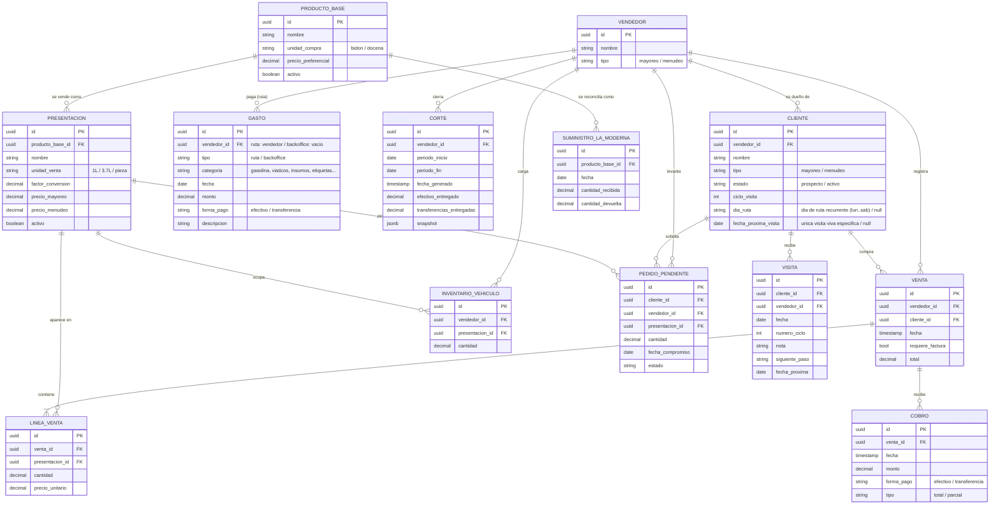

# Modelo de datos del dominio — Logiclean Ruta *(Fase 2)*

> Estado: **aprobado / congelado al cierre de Fase 2 (2026-06-11)** · Deriva del **PRD v1.2** y de los **ADR-0001…0005**. Insumo del Gate de Fase 2.

## Diagrama entidad-relación

## Los dos nudos, resueltos

### 1. Conversión bidón → presentación (dos niveles, un solo esquema)

El catálogo tiene dos niveles que conviven en el mismo molde, sin excepciones por tipo de producto:

- **PRODUCTO_BASE** es lo que se compra a La Moderna, en su `unidad_compra` (bidón para químicos, docena para escobas/trapeadores).
- **PRESENTACION** es lo que el vendedor vende, con su `unidad_venta`, sus dos precios y su `factor_conversion` (cuántas de esa presentación salen de una unidad de compra del base).

Un base puede tener **varias** presentaciones (un químico: 1 L y 3.7 L, ambas colgando del mismo bidón) o **una sola** (una escoba: solo la pieza, con `factor_conversion` = 12 desde la docena). La escoba no es un caso especial: es simplemente "un producto base con una presentación". El factor vive en la presentación porque cada una rinde distinto del mismo bidón.

### 2. Reconciliación venta-o-devolución con La Moderna

La cuenta con La Moderna se lleva **en la unidad de compra** (bidones, docenas), no en presentaciones. `SUMINISTRO_LA_MODERNA` registra, por producto base, lo `cantidad_recibida` y lo `cantidad_devuelta`. Lo que Logiclean le debe es:

> **adeudo = (recibido − devuelto) × precio_preferencial**

uniforme para todo producto. El químico simplemente tiene `cantidad_devuelta` ≈ 0, porque una vez envasado el bidón queda comprometido y no puede regresar. La escoba sí registra devoluciones reales.

El `factor_conversion` **no** entra en este cálculo de adeudo: sirve para *traducir* el lado de ventas e inventario (presentaciones) hacia la unidad de compra, para el panel del gerente y para la vista de inventario del corte (H-10), pero el dinero que se le debe a La Moderna se calcula sobre lo recibido.

## Notas de modelado

- **Cliente y prospecto son la misma entidad** (`CLIENTE`), diferenciados por `estado`. El seguimiento de prospectos vive en `ciclo_visita` + `fecha_proxima_visita`, y cada visita realizada se registra en `VISITA`. El "motor de vencimientos" (H-02) es una consulta sobre `fecha_proxima_visita`.
- **Ruta y agenda de visitas (H-08 / H-09) — resuelto en revisión de cierre.** Tres piezas, sin entidad nueva:
  - **`CLIENTE.dia_ruta`** es el **día de ruta recurrente** asignado al cliente (atributo, no visita). Es lo que hace que un cliente activo aparezca en su día sin necesidad de agendar cada semana.
  - **`CLIENTE.fecha_proxima_visita`** es la **única visita viva específica** a la vez (regla confirmada por el PM): la siguiente visita del ciclo del prospecto, o una visita puntual reprogramada (H-09 "mover de día" = actualizar esta fecha).
  - La **entrega de un pedido pendiente** no consume la visita viva: se resuelve con **`PEDIDO_PENDIENTE.fecha_compromiso`**. La "otra visita para llevar el pedido" que surge durante una visita es ese compromiso.
  - **Ruta del día (H-08)** = unión de tres fuentes: clientes con `dia_ruta` = hoy ∪ clientes/prospectos con `fecha_proxima_visita` = hoy ∪ clientes con `PEDIDO_PENDIENTE.estado` = pendiente y `fecha_compromiso` = hoy.
  - *Extensión futura conocida (no en MVP):* si el negocio llegara a necesitar **más de una visita viva por cliente** a la vez, se introduce una entidad `VISITA_PROGRAMADA` aparte. Hoy no hace falta y no se construye.
- **Inventario del vehículo en presentaciones** (unidad de venta), nunca en bidones: el envasado ocurre en bodega y queda fuera del MVP. Una `LINEA_VENTA` descuenta de `INVENTARIO_VEHICULO`.
  - *Decisión consciente de modelado (cierre de Fase 2):* `INVENTARIO_VEHICULO.cantidad` es un **contador que se decrementa** en cliente, no una bitácora de movimientos. Es aceptable porque cada vendedor es **dueño único de su dispositivo y su ruta** (ADR-0001): no hay escritura concurrente, que es lo que rompería un contador. El trade-off aceptado es menos traza de movimientos para auditoría; entra igualmente en la zona de pruebas de sincronización (T1) por ser una escritura que se resta.
- **Lista de precios:** el `tipo` del cliente decide si `LINEA_VENTA.precio_unitario` toma `precio_mayoreo` o `precio_menudeo`; se congela el precio al momento de la venta.
- **Cobranza:** una `VENTA` puede tener varios `COBRO`, cada uno con su `forma_pago` y su `tipo` (**total / parcial**). Una **venta a crédito es una venta sin cobro**: no genera fila en `COBRO`. El saldo del cliente es **derivado** (ventas − cobros), así que el crédito se refleja solo como saldo pendiente, sin capturarse como un tipo de cobro. El destino fiscal/no fiscal se deduce del cruce `requiere_factura` × `forma_pago`, no se captura a mano.
- **Cliente activo (compra sostenida):** métrica derivada (compra en ≥2 de las últimas 4 semanas), calculada sobre el histórico de `VENTA`; no es un campo almacenado.
- **Gastos (`GASTO`):** una sola entidad para los dos tipos. `tipo` = ruta (lleva `vendedor_id`) o backoffice (sin vendedor). En el corte, un gasto de **ruta** drena la bolsa de su `forma_pago` (efectivo → efectivo en mano; transferencia → saldo en banco del vendedor); un gasto de **backoffice** se reporta como salida de caja del negocio, sin tocar las bolsas del vendedor.
- **Corte semanal (H-10):** se **registra como evento de cierre** (`CORTE`) con su snapshot de totales —agrega ventas, cobros y gastos por `forma_pago`, inventario traducido a unidad de compra vía `factor_conversion`, y la reconciliación con La Moderna—. Al registrarse delimita el periodo (de un corte al siguiente) y deja traza auditable de cada liquidación (refuerza el control de R5).
- **Dashboard del gerente (H-15):** vista derivada sobre el **periodo desde el último `CORTE`**. Los indicadores de flujo (ventas, caja, gastos) se reinician al generar un corte; los de cartera (embudo, adherencia, cartera activa) son continuos y no se reinician.
- **Catálogo y clientes (H-13/H-14):** dar de baja un producto es desactivarlo (`activo` = falso), nunca borrarlo, para preservar el histórico de cortes. Reasignar un cliente es actualizar `CLIENTE.vendedor_id` —acción de administrador que cambia al dueño exclusivo del ADR-0001.
