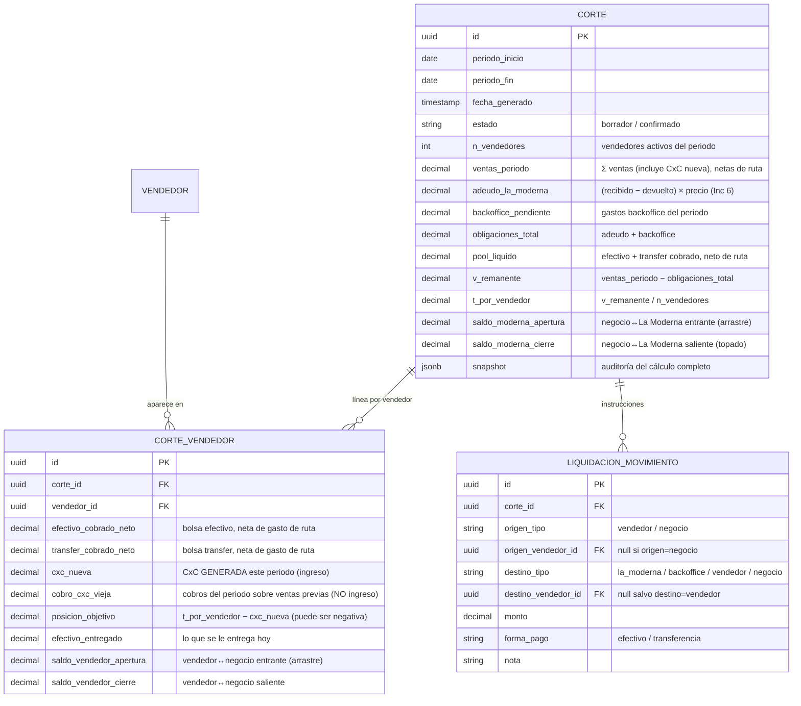

# Modelo de datos — Logiclean Ruta · **Delta v1.4 (Corte por reparto)**

> Enmienda al modelo base (`modelo-datos-logiclean.md`) y al delta de Inc 6 (`modelo-datos-inc6-bodega-envasado.md`).
> **Insumo:** PRD delta v1.4 (H-20, aprobado 2026-07-08) · ADR-0011 (posiciones netas + liquidación + arrastre).
> Convenciones heredadas: PK `uuid` con `gen_random_uuid()`; baja lógica; reconciliación con La Moderna en unidad de compra (Inc 6, vía `movimiento_la_moderna` → rollup `suministro_la_moderna`).
> **Estado de migración:** la base de producción ya está en cero (reset 2026-07-08). No se siembran saldos de arrastre: **todos los arrastres arrancan en 0** (ADR-0011).

---

## Motivo del cambio

El `CORTE` actual es **por vendedor** (`CORTE.vendedor_id`, con `efectivo_entregado` / `transferencias_entregadas` / `snapshot`). H-20 lo convierte en un **corte de negocio** que abarca a todos los vendedores del periodo, calcula el reparto en partes iguales, liquida las obligaciones y **arrastra saldos** al siguiente corte. Eso obliga a un modelo de **dos niveles** + una tabla de instrucciones de liquidación, y a hacer del arrastre un valor **de primera clase y consultable** (el corte siguiente lo lee como saldo de apertura), no un dato enterrado en `snapshot`.

---

## Reestructura: `CORTE` pasa de por-vendedor a de-negocio

**Antes (base):** un `CORTE` por vendedor. **Ahora:** un `CORTE` por **periodo de negocio**, con una **línea por vendedor** (`CORTE_VENDEDOR`) y las instrucciones de liquidación (`LIQUIDACION_MOVIMIENTO`).

**Se retira de `CORTE`:** `vendedor_id`, `efectivo_entregado`, `transferencias_entregadas` (bajan a `CORTE_VENDEDOR`).

---

## Reglas de derivación (el cálculo, declarativo)

**1. Ventas del periodo y CxC.** Por vendedor, sobre las ventas cuya fecha cae en `[periodo_inicio, periodo_fin]`:
- `efectivo_cobrado_neto` = cobros efectivo − gastos de ruta efectivo.
- `transfer_cobrado_neto` = cobros transferencia − gastos de ruta transferencia.
- `cxc_nueva` = porción a crédito de las **ventas de este periodo** aún no cobrada (venta − cobros, para ventas con `fecha` en el periodo).
- Aporte del vendedor a `ventas_periodo` = `efectivo_cobrado_neto + transfer_cobrado_neto + cxc_nueva`.

**2. Anti-doble-conteo (R9, no negociable).** `cobro_cxc_vieja` = cobros registrados **en este periodo** contra **ventas de periodos anteriores** (`venta.fecha < periodo_inicio`). **No** suma a `ventas_periodo`: ya se contó como `cxc_nueva` en su periodo de origen. Sirve para **saldar el arrastre** del vendedor, no como ingreso.

**3. Remanente y reparto.**
- `obligaciones_total` = `adeudo_la_moderna` (Inc 6) + `backoffice_pendiente`.
- `v_remanente` = `ventas_periodo` − `obligaciones_total`.
- `t_por_vendedor` = `v_remanente` / `n_vendedores`  *(N=1 ⇒ T = V; sin ramas por N — PRD §6)*.
- `posicion_objetivo` (por vendedor) = `t_por_vendedor` − `cxc_nueva`.

**4. Pool líquido y tope de La Moderna (borde).** El efectivo disponible para obligaciones **no** es todo el líquido: los vendedores con posición positiva **reservan** su parte (`T − CxC`) primero, y las obligaciones se pagan de lo que sobra.
- `pool_liquido` = Σ (`efectivo_cobrado_neto` + `transfer_cobrado_neto`)  *(líquido total del periodo)*.
- `disponible_obligaciones` = `pool_liquido` − Σ max(`posicion_objetivo`, 0)  *(lo que liberan los vendedores tras reservar su objetivo)*.
- Si `disponible_obligaciones` ≥ `obligaciones_total`: se pagan completas; `saldo_moderna_cierre` = `saldo_moderna_apertura`.
- Si no: se topa por el faltante `= obligaciones_total − disponible_obligaciones`; `saldo_moderna_cierre` = `saldo_moderna_apertura` + faltante.
- **Identidad (aserción de prueba):** ese faltante es **exactamente** la suma de las posiciones negativas, `= Σ |min(posicion_objetivo, 0)|`. Lo que los vendedores en negativo no pudieron aportar **es** lo que La Moderna no cobró: el mismo dinero visto desde dos extremos.

**5. Arrastre por actor (encadenado).**
- **Apertura = cierre del corte anterior.** `saldo_vendedor_apertura` (por vendedor) y `saldo_moderna_apertura` se leen del `CORTE` previo. Primer corte tras el reset: **ambos = 0**.
- `saldo_vendedor_cierre` = `saldo_vendedor_apertura` + (parte de `posicion_objetivo` que no se pudo liquidar este corte). Un vendedor con `posicion_objetivo` < 0 y sin liquidez para aportarla cierra **debiendo al negocio** (saldo negativo).
- Cuando ese vendedor registra `cobro_cxc_vieja` en un corte futuro, ese cobro **salda primero** su `saldo_vendedor_apertura` negativo (regla 2), y completa su T de aquel periodo.

**6. Liquidación (materializa ADR-0011).** `LIQUIDACION_MOVIMIENTO` es la salida de la pasada de posiciones netas: los movimientos mínimos que llevan a cada actor de lo que tiene a su `posicion_objetivo`, **prefiriendo efectivo sobre transferencia** y minimizando el número de filas. Que un vendedor pague una obligación desde su bolsa **es** su avance hacia el objetivo (no se le exige entregar dos veces).

---

## Estados de borde → dónde viven en el dato

| Estado de borde (PRD H-20) | Señal en el modelo |
|---|---|
| La Moderna topada | `saldo_moderna_cierre` > `saldo_moderna_apertura` (faltante nuevo este corte) |
| Vendedor en negativo | `CORTE_VENDEDOR.posicion_objetivo` < 0 ∧ `saldo_vendedor_cierre` < 0 |
| Arrastre entrante | `saldo_vendedor_apertura` ≠ 0 ∨ `saldo_moderna_apertura` ≠ 0 |
| Alerta de identidad de control | Ya en Inc 6: `movimiento_la_moderna` (recibido − devuelto) vs. Σ `envasado.bidones_abiertos`. El corte la **lee**; no añade tabla. |

---

## Notas de modelado

- **Agnóstico al número de vendedores.** `n_vendedores` + filas de `CORTE_VENDEDOR` = los activos del periodo. El cambio de conjunto entre cortes (entra mayoreo) no requiere recálculo: el arrastre es **por actor** (`vendedor_id`), sobrevive la transición.
- **`snapshot` se conserva** como auditoría inmutable del cálculo completo del corte (refuerza R5), pero los valores que el corte siguiente necesita leer (arrastres) son **columnas**, no `snapshot`.
- **Backoffice.** `backoffice_pendiente` se deriva de `GASTO` (`tipo=backoffice`) del periodo aún no liquidado; su pago genera `LIQUIDACION_MOVIMIENTO` con `destino_tipo=backoffice`.
- **Determinismo.** Todo el cálculo (reglas 1–6) es función pura de los datos del periodo + los saldos de apertura. Se implementa en la capa de dominio, testeable sin UI (PRD §6).

---

## Cascada pendiente tras este delta

`plan de incrementos` (ubicar el incremento; hito = primer corte de negocio que cuadra con N=1) → **Fase 3 (Design)**: prototipo del stepper con los 4 estados de borde → **handoff → Fase 4 (Code)**. La **capa de dominio** (reglas 1–6 + casos de prueba de los ejemplos trabajados) puede adelantarse en Code sin esperar a la UI.
